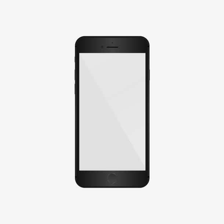

# HTML+CSS+JS案例展示(放大镜效果)
>   参考来源：
>
> [JavaScript基础语法-dom-bom-js-es6新语法-jQuery-数据可视化echarts黑马pink老师前端入门基础视频教程(500多集)持续_哔哩哔哩_bilibili](https://www.bilibili.com/video/BV1Sy4y1C7ha?p=244&spm_id_from=pageDriver)

## 效果展示：


## 网页GitHub地址如下：（若加载较慢建议刷新后耐心等待一会~）

https://zhiyuanda.github.io/js_big/

## 主要功能：

放大镜效果

**网页代码如下：**

### HTML：

```html
<!DOCTYPE html>
<html lang="en">
<head>
    <meta charset="UTF-8">
    <meta http-equiv="X-UA-Compatible" content="IE=edge">
    <meta name="viewport" content="width=device-width, initial-scale=1.0">
    <title>js_big</title>
    <link rel="stylesheet" href="index.css">
    <script src="index.js"></script>
</head>
<body>
    <div class="preview">
        
        <div class="mask"></div>
        <div class="big">
            
        </div>
    </div>
</body>
</html>
```


### CSS：

```css
* {
    margin: 0;
    padding: 0;
}
.preview {
    position: relative;
    margin: 100px 100px;
    width: 450px;
    height: 450px;
    border: 1px solid #ccc;
    cursor: move;
}
.mask {
    display: none;
    position: absolute;
    top: 0;
    left: 0;
    width: 300px;
    height: 300px;
    background-color: rgb(248, 220, 97);
    opacity: .5;
}
.big {
    display: none;
    position: absolute;
    overflow: hidden;
    top: 0;
    left: 452px;
    width: 540px;
    height: 540px;
    border: 1px solid #ccc;
}
.bigImg {
    position: absolute;
    top: 0;
    left: 0;
}
```


### JS：

```javascript
window.addEventListener('load',function() {
    var mask = document.querySelector('.mask');
    var big = document.querySelector('.big');
    var preview = document.querySelector('.preview');
    //鼠标移入preview中，显示遮罩层mask和大图big
    preview.addEventListener('mouseover',function() {
        mask.style.display = 'block';
        big.style.display = 'block';
    })
    //鼠标移出preview，隐藏遮罩层mask和大图big
    preview.addEventListener('mouseout',function() {
        mask.style.display = 'none';
        big.style.display = 'none';
    })
    //鼠标移入preview中，遮罩层随鼠标移动而移动，右边显示大图效果
    preview.addEventListener('mousemove',function(e) {
        //鼠标在preview盒子中的坐标
        var x = e.pageX - this.offsetLeft;
        var y = e.pageY - this.offsetTop;
        //使鼠标在mask的中心
        var maskX = x - mask.offsetWidth / 2;
        var maskY = y - mask.offsetHeight / 2;
        //mask在preview中最大移动距离
        var maskMax = this.offsetWidth - mask.offsetWidth;
        //不让mask超出preview的范围
        maskX = maskX >= 0 ? maskX : 0;
        maskX = maskX < maskMax ? maskX : maskMax;
        maskY = maskY >= 0 ? maskY : 0;
        maskY = maskY < maskMax ? maskY : maskMax;
        //将鼠标在preview盒子中的坐标赋值给mask在preview中的坐标
        mask.style.left = maskX + 'px';
        mask.style.top = maskY + 'px';
        var bigImg = document.querySelector('.bigImg');
        //bigImg在big中最大移动距离
        var bigImgMax = bigImg.offsetWidth - big.offsetWidth;
        //大图bigImg在big中移动距离 = 遮罩层移动距离 * 大图最大移动距离 / 遮罩层最大移动距离
        bigImgX = maskX * bigImgMax / maskMax;
        bigImgY = maskY * bigImgMax / maskMax;
        //大图移动方向与遮罩层相反
        bigImg.style.left = -bigImgX +'px';
        bigImg.style.top = -bigImgY +'px';
    })
})
```

